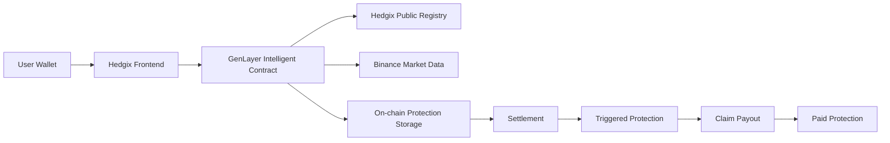
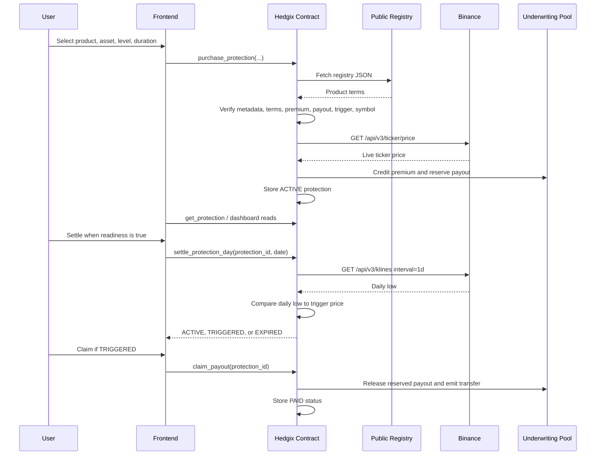

# Hedgix

Hedgix is a crypto market protection application powered by GenLayer, using a public product registry, Binance market data, and on-chain protection records to manage defined price-drop and stablecoin depeg protection.

- Live demo: Pending confirmation
- Deployed contract: `0x5cA80eB0744574aD2214291e89aA547168c28084`
- Network: GenLayer Bradbury, chain ID `4221`
- Public registry: `https://hedgix-market-registry.netlify.app/hedgix-market-protection-registry.v1.json`

## Live Demo

| Item | Status |
| --- | --- |
| Live application URL | Pending confirmation |
| Deployed contract address | `0x5cA80eB0744574aD2214291e89aA547168c28084` |
| Network | GenLayer Bradbury testnet, `testnetBradbury`, chain ID `4221` |
| RPC URL | `https://rpc-bradbury.genlayer.com` |
| Explorer URL | `https://explorer-bradbury.genlayer.com` |
| Registry URL | `https://hedgix-market-registry.netlify.app/hedgix-market-protection-registry.v1.json` |

## Overview

Hedgix lets a wallet buy fixed-duration protection for supported crypto markets. Each protection record is stored by the GenLayer Intelligent Contract with the selected product terms, owner, coverage period, premium, payout, reference price, trigger price, latest settlement fields, and status.

It is built for users who want transparent protection terms around two risk classes:

- Price-drop risk for supported crypto pairs.
- Stablecoin depeg risk for supported USD stablecoin markets.

The current registry supports:

| Product | Protected assets | Binance symbols |
| --- | --- | --- |
| Price Drop Protection | `BTCUSDT`, `ETHUSDT`, `SOLUSDT`, `BNBUSDT` | Same as protected asset |
| Depeg Protection | `USDT`, `USDC` | `USDTUSD`, `USDCUSD` |

Key terms:

| Term | Meaning in Hedgix |
| --- | --- |
| Protected asset | The selected asset or market from the registry. |
| Premium | The GEN amount paid by the buyer when purchasing protection. Current registry levels use `1 GEN`. |
| Coverage period | The protected UTC date range. Coverage starts the day after purchase and runs for `7`, `14`, or `30` days. |
| Reference price | The Binance live ticker price fetched and stored by the contract during purchase. |
| Trigger price | For price-drop products, the reference price reduced by the registry percentage. For depeg products, the absolute USD threshold from the registry. |
| Settlement price | The Binance `1d` kline low for the exact settlement date. |
| Payout | The reserved GEN amount claimable after a protection becomes `TRIGGERED`. Current registry payouts are `2`, `3`, or `4 GEN`. |
| Reserved liability | Pool balance reserved for the maximum payout of active or triggered protections. |
| Underwriting pool | Contract-held GEN balance used to reserve and pay payouts. |
| Protection status | One of `ACTIVE`, `TRIGGERED`, `PAID`, `EXPIRED`, or `CANCELLED`. |

## The Problem

Crypto holders face market events such as sharp price drops and stablecoin depegs. Traditional protection products can be slow, opaque, hard to access, or dependent on off-chain discretion. Users need clear product terms, visible settlement rules, public data sources, and a direct view of whether a position is active, triggered, expired, cancelled, or paid.

## The Solution

Hedgix combines:

- A public product registry for supported products, assets, durations, premiums, payouts, trigger rules, and Binance symbols.
- A GenLayer Intelligent Contract that independently fetches and verifies registry terms.
- Binance public market data for purchase reference prices and settlement observations.
- On-chain protection records scoped to wallet ownership.
- Rule-based sequential settlement over closed daily market data.
- Explicit status transitions and payout handling from a reserved underwriting pool.

The frontend is not the final source of truth for product terms or settlement decisions. It displays data and constructs transactions. The contract re-fetches and verifies the registry and market data before storing or changing protection state.

## How Hedgix Works

1. The user selects a supported protection product.
2. The frontend displays product terms from the registry.
3. The user submits a purchase transaction with the selected asset, product type, event level, duration, and premium.
4. The contract fetches the official Hedgix registry from `registry_url`.
5. The contract verifies registry metadata, selected asset, protection type, event level, duration, premium, payout, trigger rule, registry version, network, app name, status, and Binance symbol.
6. The contract fetches Binance live ticker data from `/api/v3/ticker/price`.
7. The contract calculates and stores the trigger price.
8. The contract stores an `ACTIVE` protection and reserves the payout as liability.
9. Settlement fetches the required Binance `1d` kline for the exact settlement date.
10. The contract compares the daily low with the stored trigger price.
11. The protection remains `ACTIVE`, becomes `TRIGGERED`, or becomes `EXPIRED` according to the implemented rules.
12. A `TRIGGERED` protection can be claimed by the protection owner.
13. The final status becomes `PAID` when `claim_payout` updates state and emits the GEN transfer.

## Core Features

- Public registry-verified product catalog.
- Price Drop Protection for `BTCUSDT`, `ETHUSDT`, `SOLUSDT`, and `BNBUSDT`.
- Depeg Protection for `USDT` and `USDC` using direct USD Binance symbols.
- Purchase-time Binance live ticker reference pricing.
- Daily settlement using Binance `1d` kline lows.
- Trigger detection against stored trigger prices.
- Wallet-scoped dashboard and protection detail pages.
- Cancellation for `ACTIVE` protections by the protection owner.
- Expiry when the final coverage day settles without a trigger.
- Payout claims for `TRIGGERED` protections.
- Underwriting pool, reserved liability, total premium, and total payout accounting.
- Owner controls for pool withdrawal, settlement operator, pause, and unpause.
- Settlement operator and policyholder settlement paths.
- Public registry, markets, documentation, transparency, dashboard, policy, protect, and admin frontend routes.
- Cloudflare Worker settlement automation is present in `cron/` with a scheduled trigger and manual protected endpoint.
- Planned: stronger registry integrity controls and complete end-to-end transaction evidence.

## Architecture



The frontend displays registry and contract data, helps users build transactions, and tracks GenLayer transaction status. The contract independently verifies official product terms. The registry defines allowed products and terms. Binance provides market observations. GenLayer handles nondeterministic web reads and validator consensus. Protection state is stored in the contract. The frontend is not trusted to decide the purchase terms, reference price, settlement value, trigger result, payout eligibility, or final state.

This is not a fully decentralized system. The registry is externally hosted, Binance is the current market-data source, and settlement can depend on an external caller or scheduler.

## Trust Model and Data Sources

### Frontend Trust Boundary

The frontend controls display, transaction construction, wallet connection, and UX state. It does not control the final protection record or settlement decision.

Confirmed contract-side verification:

| Field or decision | Verified by contract |
| --- | --- |
| Supported asset | Yes |
| Protection type | Yes |
| Product ID | No product ID field exists in the current registry |
| Event level | Yes |
| Duration | Yes |
| Premium | Yes |
| Payout | Yes |
| Trigger percentage | Yes, for `price_drop_protection` |
| Trigger threshold | Yes, for `depeg_protection` |
| Registry version | Yes |
| Registry name, network, app name, status | Yes |
| Binance symbol | Yes, loaded from the selected registry asset and required to be non-empty |
| Reference price | Yes, fetched by contract from Binance live ticker |
| Settlement price | Yes, fetched by contract from Binance `1d` klines |
| Settlement result | Yes, calculated by contract |

### Public Hedgix Registry

Registry URL:

```text
https://hedgix-market-registry.netlify.app/hedgix-market-protection-registry.v1.json
```

Registry version: `v1`

Registry metadata:

| Field | Value |
| --- | --- |
| `registry_name` | `Hedgix Market Protection Registry` |
| `registry_version` | `v1` |
| `network` | `GenLayer Bradbury` |
| `app_name` | `Hedgix` |
| `status` | `draft` |

Each product entry contains `protection_type`, `display_name`, `supported_assets`, and `event_levels`. Depeg products also include `description` and `threshold_type`. Supported assets include `asset` and `binance_settlement_symbol`; depeg assets also include `protected_asset`, `display_name`, `settlement_symbol`, `quote_currency`, and `protection_type`. Event levels contain `name`, `trigger_rule`, `premium`, and `payout`.

The contract fetches the registry during `purchase_protection`. If the fetch fails, it raises `REGISTRY_FETCH_FAILED`. Empty, invalid, or metadata-mismatched responses raise `INVALID_REGISTRY_RESPONSE`. Missing products, assets, event levels, or durations raise the corresponding unsupported error. Submitted terms that do not match the selected registry-derived terms raise `REGISTRY_TERMS_MISMATCH`.

| Registry responsibility | Verified by contract |
| --- | --- |
| Supported asset | Yes |
| Product type | Yes |
| Premium | Yes |
| Payout | Yes |
| Trigger rule | Yes |
| Duration | Yes |
| Binance symbol | Yes |
| Registry version | Yes |

### Binance Market Data

Binance base URL:

```text
https://data-api.binance.vision
```

Purchase reference price:

| Item | Current implementation |
| --- | --- |
| Endpoint | `/api/v3/ticker/price?symbol={symbol}` |
| Symbol | Registry `binance_settlement_symbol` |
| Field used | `price` |
| Stored source | `binance_ticker_price` |
| Historical versus live mode | Live ticker only in the current main contract |
| Tolerance | Validator price may differ by up to `LIVE_PRICE_TOLERANCE_BPS = 200` basis points |

Settlement price:

| Item | Current implementation |
| --- | --- |
| Endpoint | `/api/v3/klines?symbol={symbol}&interval=1d&startTime={start_ms}&endTime={end_ms}&limit=1` |
| Symbol | Stored protection `binance_settlement_symbol` |
| Interval | `1d` |
| Field used | Kline low at index `3` |
| Date handling | UTC date converted to `[start_ms, start_ms + DAY_MS - 1]`; row open and close times must match exactly |
| Scaling | Prices are parsed to `PRICE_SCALE = 100000000` integer units |
| Rounding | Decimal strings are truncated or padded to 8 decimal places |
| Tolerance | Validator scaled price must differ by at most `PRICE_TOLERANCE_SCALED = 1` |

The archived historical MVP used historical kline reference pricing, but the current main contract uses the live ticker for purchases and daily klines for settlement.

### Explicit Trust Assumptions

- The registry host remains available.
- The registry publisher preserves product integrity.
- Registry updates are controlled off-chain by the publisher.
- Binance endpoints remain available and return accurate market data.
- The current symbol mapping remains correct for each product.
- GenLayer validators can access the same public registry and Binance data.
- Settlement is called for the correct expected date by the owner, settlement operator, protection owner, frontend, or scheduler.
- The Cloudflare Worker settlement operator key and API token remain secure.
- The underwriting pool has enough liquid GEN to reserve and pay claims.
- The hosted frontend remains available.
- Wallet-scoped frontend views do not make on-chain records private.
- Native GEN transfer success is not synchronously observable by the contract after `emit_transfer`.

### Failure Handling

| Failure case | Contract behavior |
| --- | --- |
| Registry unavailable | `REGISTRY_FETCH_FAILED` |
| Registry body missing | `INVALID_REGISTRY_RESPONSE` |
| Product not found | `UNSUPPORTED_PROTECTION_TYPE`, `UNSUPPORTED_ASSET`, or `UNSUPPORTED_EVENT_LEVEL` |
| Terms mismatch | `REGISTRY_TERMS_MISMATCH` |
| Binance ticker unavailable | `BINANCE_TICKER_FETCH_FAILED` |
| Binance ticker body invalid | `INVALID_BINANCE_TICKER_RESPONSE`, `BINANCE_TICKER_PRICE_MISMATCH`, or `BINANCE_TICKER_PRICE_MISSING` |
| Binance kline unavailable | `BINANCE_FETCH_FAILED` |
| Candle missing | `BINANCE_KLINE_MISSING` |
| Invalid date | `INVALID_DATE_FORMAT`, `SETTLEMENT_DATE_BEFORE_COVERAGE_START`, `SETTLEMENT_DATE_AFTER_COVERAGE_END`, `DAILY_CANDLE_NOT_CLOSED`, or `SETTLEMENT_DATE_NOT_SEQUENTIAL` |
| Protection not `ACTIVE` for settlement or cancellation | Status-specific error such as `PROTECTION_ALREADY_TRIGGERED`, `PROTECTION_ALREADY_PAID`, `PROTECTION_ALREADY_EXPIRED`, `PROTECTION_ALREADY_CANCELLED`, or `PROTECTION_NOT_ACTIVE` |
| Insufficient payout liquidity | `INSUFFICIENT_POOL_CAPACITY` during purchase or `INSUFFICIENT_POOL_BALANCE` during claim |

## End-to-End Protection Flow



## Intelligent Contract Methods

### Purchase

| Method | Type | Purpose | Main inputs | Main result |
| --- | --- | --- | --- | --- |
| `purchase_protection` | Write, payable | Buy supported protection after registry and Binance verification | `protected_asset`, `protection_type`, `event_level`, `duration_days`, `gl.message.value` | New `protection_id`, stored `ACTIVE` record |

### Historical Testing

| Method | Type | Purpose | Main inputs | Main result |
| --- | --- | --- | --- | --- |
| Pending confirmation | Evidence pending | No public historical testing method exists in the current main `contract/Hedgix.py` | N/A | N/A |

Archived note: `contract/archive/HedgixHistoricalMVP.py` contains `create_historical_protection`, but it is not part of the active main contract.

### Settlement

| Method | Type | Purpose | Main inputs | Main result |
| --- | --- | --- | --- | --- |
| `settle_protection_day` | Write | Settle the exact next eligible daily candle | `protection_id`, `settlement_date` | JSON string with settlement date, daily low, trigger price, trigger result, and resulting status |
| `get_expected_settlement_date` | View | Read the next required settlement date | `protection_id` | Date string or empty string |
| `get_settlement_readiness` | View | Read whether settlement can be submitted | `protection_id` | JSON string with `ready`, `reason`, `expected_settlement_date`, `latest_closed_daily_date`, `status` |

### Claims and Payouts

| Method | Type | Purpose | Main inputs | Main result |
| --- | --- | --- | --- | --- |
| `claim_payout` | Write | Claim reserved payout for a `TRIGGERED` protection | `protection_id` | Status becomes `PAID`, reserved liability and pool balance decrease, transfer emitted |

### Cancellation and Expiry

| Method | Type | Purpose | Main inputs | Main result |
| --- | --- | --- | --- | --- |
| `cancel_protection` | Write | Cancel an `ACTIVE` protection by owner | `protection_id` | Status becomes `CANCELLED`, reserved payout released |
| `settle_protection_day` | Write | Expire a protection on final covered day when not triggered | `protection_id`, `settlement_date` | Status becomes `EXPIRED`, reserved payout released |

### Pool and Admin

| Method | Type | Purpose | Main inputs | Main result |
| --- | --- | --- | --- | --- |
| `add_pool_funds` | Write, payable | Add GEN liquidity to the underwriting pool | `gl.message.value` | Pool balance increases |
| `withdraw_from_pool_gen` | Write | Owner withdraws unreserved whole GEN | `amount_gen` | Pool balance decreases and transfer emitted |
| `set_settlement_operator` | Write | Owner sets settlement operator address | `operator_address` | Settlement operator updated |
| `pause_contract` | Write | Owner pauses write actions guarded by pause check | None | `paused = True` |
| `unpause_contract` | Write | Owner resumes paused contract | None | `paused = False` |
| `get_pool_status` | View | Read pool accounting | None | JSON string with pool balance, reserved liability, withdrawable amount, total premiums, total payouts |
| `get_owner` | View | Read owner | None | Owner address |
| `get_settlement_operator` | View | Read settlement operator | None | Settlement operator address |
| `is_paused` | View | Read pause state | None | Boolean |

### Wallet-Scoped Reads

| Method | Type | Purpose | Main inputs | Main result |
| --- | --- | --- | --- | --- |
| `get_my_dashboard_summary` | View | Read connected wallet protection dashboard | Caller wallet | JSON string with counts, IDs, and protection rows |
| `get_my_dashboard_summary_paginated` | View | Read paginated connected wallet dashboard | Caller wallet, `start`, `limit` | JSON string with page metadata and protection rows |
| `get_my_protection_ids` | View | Read protection IDs owned by caller | Caller wallet | JSON array string |
| `get_protection` | View | Read stored protection record | `protection_id` | JSON string protection record |

### Public Transparency Reads

| Method | Type | Purpose | Main inputs | Main result |
| --- | --- | --- | --- | --- |
| `get_dashboard_summary` | View | Read global contract and pool summary | None | JSON string with owner, operator, registry, pause, active count, and pool fields |
| `get_active_protection_ids` | View | Read active protection IDs | None | JSON array string |
| `get_active_protection_ids_paginated` | View | Read paginated active protection IDs | `start`, `limit` | JSON string with page metadata and `protection_ids` |
| `get_registry_url` | View | Read registry URL | None | Registry URL |
| `get_registry_version` | View | Read registry version | None | Registry version |

## Stack

| Layer | Technology |
| --- | --- |
| Frontend | React 19, TypeScript, Vite 8, TanStack Router/Start, TanStack Query |
| Styling | Tailwind CSS 4, Radix UI components, lucide-react icons |
| Wallet | Wagmi, RainbowKit, injected wallet connector only; WalletConnect disabled |
| Intelligent Contract | Python GenLayer Intelligent Contract with pinned `py-genlayer` runner |
| Contract client | `genlayer-js` 1.1.8 |
| Market Data | Binance public API at `https://data-api.binance.vision` |
| Product Registry | Public versioned JSON registry |
| Hosting | Frontend production host pending confirmation; registry hosted on Netlify URL; settlement Worker configured for Cloudflare Workers |
| Testing | Bun test, TypeScript `tsc --noEmit`, ESLint, local source-level tests |
| Development | npm scripts, Bun lockfile, Vite dev server, Wrangler for `cron/` |

## Screenshots

Screenshot 1


Caption:

Hedgix landing page showing the main product value proposition.

Screenshot 2


Caption:

Protection purchase page showing the selected asset, premium, payout, coverage period, and trigger terms.

Screenshot 3


Caption:

Wallet-scoped dashboard showing an ACTIVE protection with its reference price, trigger price, dates, and payout amount.

Screenshot 4


Caption:

GenLayer Studio or application evidence showing settlement, trigger status, and the final payout state.

## Testing and Transaction Evidence

| Stage | Contract method | External source | Expected state | Evidence |
| --- | --- | --- | --- | --- |
| Product verification | `purchase_protection` | Hedgix registry | Terms verified | Implemented and source-tested; transaction evidence pending |
| Reference price | `purchase_protection` | Binance live ticker | Reference and trigger stored | Implemented; transaction evidence pending |
| Purchase | `purchase_protection` | Registry and Binance | `ACTIVE` | Implementation and frontend confirmation logic tested; complete transaction evidence pending |
| Settlement | `settle_protection_day` | Binance `1d` kline low | `ACTIVE`, `TRIGGERED`, or `EXPIRED` | Implemented; complete transaction evidence pending |
| Claim or payout | `claim_payout` | Stored protection and pool | `PAID` | Implemented; complete payout evidence pending |

### Verified End-to-End Evidence

Core purchase and settlement logic is implemented. Complete transaction evidence is still being documented. The repository does not yet claim a fully verified end-to-end payout until the purchase, settlement, trigger, claim, and final PAID state evidence are attached.

Complete proof means:

- Public registry product entry.
- Successful purchase transaction.
- Stored `ACTIVE` protection.
- Stored reference price.
- Stored trigger price.
- Successful settlement transaction.
- Settlement date and market value.
- Trigger comparison result.
- `TRIGGERED` status.
- Successful claim or payout.
- Final `PAID` protection.
- Pool and reserved-liability changes when applicable.

Current local tests cover registry parsing, symbols, wallet configuration, GenLayerJS usage, transaction status handling, contract response parsing, frontend routes, write-state confirmation, and supported UI behavior. Historical endpoint research exists in `docs/HISTORICAL_TESTING_RESULTS.md`, but that document also contains stale values and does not include executed GenLayer contract transactions.

## Configuration

### Frontend Environment Variables

| Variable | Required | Purpose |
| --- | --- | --- |
| `VITE_HEDGIX_CONTRACT_ADDRESS` | Yes for contract actions | Deployed Hedgix contract address. Example value is `0x5cA80eB0744574aD2214291e89aA547168c28084`. |
| `VITE_GENLAYER_NETWORK` | Documented in example | Example value `testnetBradbury`; runtime code currently fixes network as `testnetBradbury`. |
| `VITE_GENLAYER_RPC_URL` | Optional | Overrides default Bradbury RPC URL. |
| `VITE_GENLAYER_EXPLORER_URL` | Optional | Overrides default Bradbury explorer URL. |
| `VITE_HEDGIX_REGISTRY_URL` | Optional | Overrides default registry URL used by the frontend registry proxy. |

### Contract Constants

| Constant | Value | Purpose |
| --- | --- | --- |
| `REGISTRY_NAME` | `Hedgix Market Protection Registry` | Required registry metadata name. |
| `REGISTRY_VERSION` | `v1` | Required registry version. |
| `NETWORK_NAME` | `GenLayer Bradbury` | Required registry network. |
| `APP_NAME` | `Hedgix` | Required registry app name. |
| `DEFAULT_REGISTRY_URL` | `https://hedgix-market-registry.netlify.app/hedgix-market-protection-registry.v1.json` | Default registry source. |
| `BINANCE_BASE_URL` | `https://data-api.binance.vision` | Binance API host. |
| `PRICE_SCALE` | `100000000` | Fixed-point price scale. |
| `LIVE_PRICE_TOLERANCE_BPS` | `200` | Purchase ticker validator tolerance. |
| `PRICE_TOLERANCE_SCALED` | `1` | Settlement kline validator tolerance. |
| `GEN_WEI` | `1000000000000000000` | GEN token scaling. |

### Registry URLs

| Item | Value |
| --- | --- |
| Local registry source | `registry/hedgix-market-protection-registry.v1.json` |
| Public registry URL | `https://hedgix-market-registry.netlify.app/hedgix-market-protection-registry.v1.json` |
| Frontend same-origin proxy | `/api/registry` |

### Deployment Configuration

| Area | File | Notes |
| --- | --- | --- |
| Frontend build | `frontend/package.json`, `frontend/vite.config.ts` | Vite build through `npm run build`. Production host pending confirmation. |
| Settlement Worker | `cron/wrangler.jsonc` | Cloudflare Worker named `cron`, scheduled at `30 1 * * *`. |
| Worker secrets | `cron/src/index.ts` | Expects `SETTLEMENT_OPERATOR_PRIVATE_KEY` and `SETTLEMENT_API_TOKEN`; do not commit secrets. |

## Project Structure

```text
hedgix/
├── contract/
│   ├── Hedgix.py
│   └── archive/HedgixHistoricalMVP.py
├── cron/
│   ├── src/index.ts
│   ├── package.json
│   └── wrangler.jsonc
├── docs/
│   ├── CONTRACT_READINESS_AUDIT.md
│   ├── HISTORICAL_TESTING_RESULTS.md
│   ├── SCREENSHOT_CHECKLIST.md
│   └── images/
├── evidence/
│   └── README.md
├── frontend/
│   ├── src/routes/
│   ├── src/components/
│   ├── src/lib/
│   ├── tests/
│   ├── .env.example
│   ├── package.json
│   └── vite.config.ts
├── registry/
│   ├── hedgix-market-protection-registry.v1.json
│   ├── index.html
│   └── README.md
└── README.md
```

## Getting Started

Prerequisites:

- Node.js compatible with the frontend toolchain.
- npm.
- Bun for the current frontend test script.
- Browser wallet compatible with injected EVM providers.
- GenLayer Bradbury access for contract reads and writes.

Frontend setup:

```bash
cd frontend
npm install
cp .env.example .env
npm run dev
```

Useful frontend commands:

```bash
npm run typecheck
npm run lint
npm run test
npm run build
```

Settlement Worker commands:

```bash
cd cron
npm install
npm run dev
npm run deploy
```

Contract deployment steps: Evidence pending. The repository contains the contract source and historical Studio debugging notes, but no current deployment script was found.

## Current Status

| Area | Status | Notes |
| --- | --- | --- |
| Frontend | Implemented/Tested | Routes and GenLayerJS integration exist; production live URL pending confirmation. |
| Contract | Implemented | Main contract exists at `contract/Hedgix.py`; complete transaction evidence pending. |
| Registry verification | Implemented/Tested | Contract verifies registry terms; frontend validates registry shape. |
| Binance integration | Implemented | Contract uses live ticker for purchase and `1d` kline low for settlement. |
| Purchase flow | Implemented/Tested | Frontend write path and state confirmation are tested; transaction evidence pending. |
| Settlement flow | Implemented | Manual/admin path and cron Worker exist; transaction evidence pending. |
| Claim and payout | Implemented | Contract and frontend claim path exist; payout proof pending. |
| End-to-end evidence | Pending | Complete purchase, settlement, trigger, claim, and `PAID` evidence not attached. |
| WalletConnect | Disabled | Injected wallet connector only. |
| Production deployment | Pending | Contract address is configured; live app URL is pending confirmation. |

## Limitations and Trust Assumptions

- The hosted registry is an external dependency.
- Registry updates are controlled by the publisher.
- Binance is the current sole market-data provider.
- Settlement may require an external caller or scheduled Worker.
- The settlement caller pays or controls the settlement transaction path.
- Historical testing docs do not represent the current main contract method surface.
- Current confirmed assets are limited to `BTCUSDT`, `ETHUSDT`, `SOLUSDT`, `BNBUSDT`, `USDT`, and `USDC`.
- Payouts depend on pool liquidity and reserved-liability accounting.
- Hedgix protection is not a bank deposit.
- Hedgix is not presented here as licensed insurance.
- Blockchain storage may be publicly observable.
- Wallet-scoped frontend views do not make on-chain data private.
- Purchase ticker tolerance and settlement kline tolerance are explicit assumptions in validator agreement.
- Provider or RPC outages may delay purchase confirmation, settlement, or frontend state reads.
- `emit_transfer` success or failure is not synchronously observable inside the contract code.

## Roadmap

Planned improvements:

- Stronger registry integrity controls.
- Registry version pinning beyond metadata.
- Registry content hashes or signed registry releases.
- Additional market-data sources.
- Provider fallback for market-data reads.
- Automated settlement scheduler hardening.
- Settlement retries and evidence capture.
- Expanded direct-mode and integration test coverage.
- More supported assets after registry and contract review.
- Production security review.
- Pool risk controls.
- Improved evidence documentation for purchase, settlement, trigger, claim, and payout flows.

## License

No license has been selected yet.
