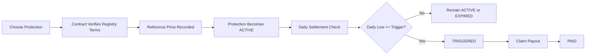
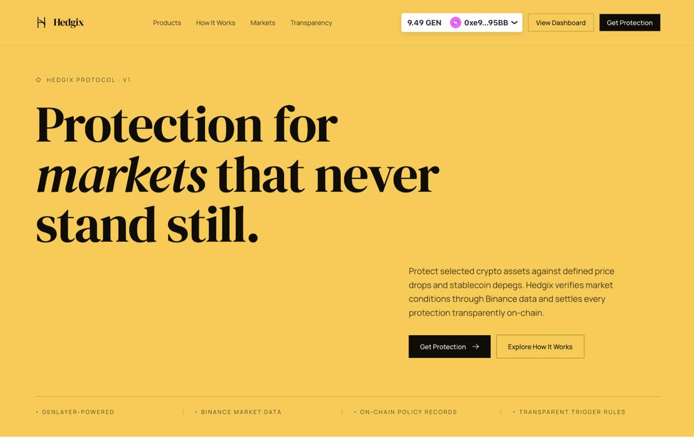
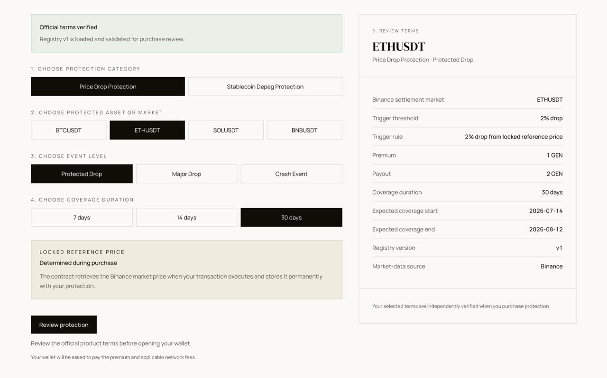
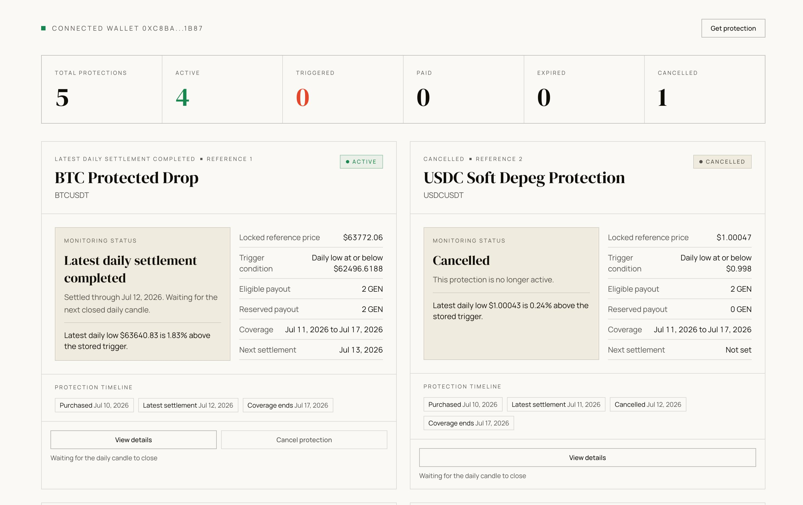
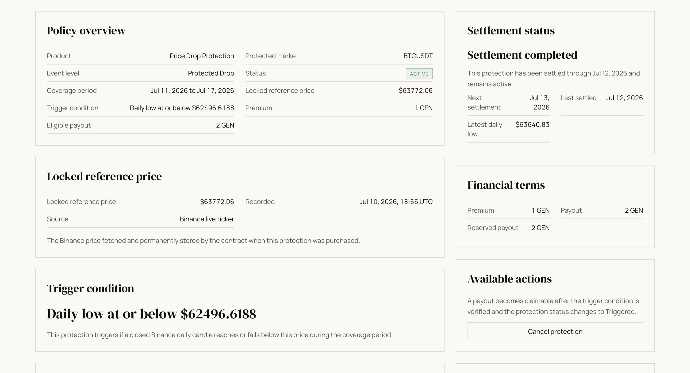
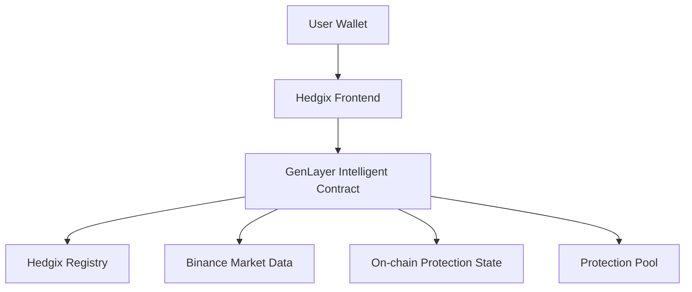

# Hedgix

**Crypto market protection powered by GenLayer.**

Hedgix is a GenLayer-powered crypto protection application that lets users protect eligible assets against predefined market events. Product terms are verified by the Intelligent Contract, settlement uses public Binance market data, and eligible payouts are handled on-chain.

## Why Hedgix Uses GenLayer

Hedgix is a validator-backed parametric crypto market protection protocol.

GenLayer consensus directly determines financially meaningful contract state. The contract independently fetches and verifies official protection terms from the Hedgix registry and retrieves Binance market evidence before creating protections or resolving daily settlement outcomes.

The frontend is not trusted to supply authoritative premiums, payouts, symbols, trigger thresholds, reference prices, or settlement results.

Validated evidence affects:

- protection creation
- reference price
- trigger price
- reserved liability
- ACTIVE, TRIGGERED, and EXPIRED status
- payout eligibility

Ticker and historical-candle validators independently retrieve Binance data and compare decision-relevant evidence, including symbols, timestamps, price fields, positive prices, and leader-validator price equivalence.

Hedgix is not an AI advice, recommendation, or summarization product. GenLayer consensus is required because verified external evidence controls on-chain financial state and payout rights.

## Submission Links

- Live app: https://hedgix.xyz
- Source code: https://github.com/jason4185/hedgix
- Production contract: `0xFc7A79324f8624DeFb10e9771Af45A5444ea708D`
- Network: GenLayer Bradbury
- Contract source: `contract/Hedgix.py`
- Registry: `registry/hedgix-market-protection-registry.v1.json`
- Settlement worker: `cron/`

Hedgix is a protection product, not licensed insurance. The repository does not claim regulatory insurance status.

## What Hedgix Does

Crypto holders can face sudden price drops and stablecoin depeg events. Hedgix creates fixed-period protection positions with clear terms before purchase: protected asset, protection type, event level, duration, premium, trigger rule, and eligible payout.

The current production registry supports:

| Product | Protected assets | Binance settlement symbols | Event levels |
| --- | --- | --- | --- |
| Price Drop Protection | `BTCUSDT`, `ETHUSDT`, `SOLUSDT`, `BNBUSDT` | Same as protected asset | Protected Drop `2%`, Major Drop `3%`, Crash Event `4%` |
| Depeg Protection | `USDT`, `USDC` | `USDTUSD`, `USDCUSD` | Soft Depeg `$0.998`, Deep Depeg `$0.996`, Severe Depeg `$0.994` |

Supported durations are `7`, `14`, and `30` days. Current registry premiums are `1 GEN`; current eligible payouts are `2`, `3`, or `4 GEN` depending on the selected event level.

The frontend helps users choose and review protection. The contract controls the final verification, reference price, trigger calculation, settlement result, and payout eligibility.

## How It Works

1. The user chooses a supported protection product.
2. The frontend shows registry-backed product terms.
3. The user submits a purchase transaction with the required premium.
4. The Intelligent Contract fetches and verifies the official registry terms and Binance reference price.
5. The contract stores an `ACTIVE` protection and later checks a closed Binance daily candle against the stored trigger price.
6. The protection becomes `ACTIVE`, `TRIGGERED`, `EXPIRED`, `CANCELLED`, or `PAID` according to the contract rules.



## UI Tour

### Landing Page



Explore Hedgix and understand the protection model.

### Protection Purchase



Choose an asset, protection type, event level, duration, premium, and payout.

### Protection Dashboard



Track wallet-scoped protection positions and their current status.

### Protection Details



Review reference price, trigger price, coverage period, settlement state, and payout eligibility.

## Key Innovations

**Contract-Verified Product Terms**

The frontend does not define the premium, payout, trigger rule, supported asset, duration, or settlement symbol. `purchase_protection` fetches the public Hedgix registry and verifies the selected terms before creating a position.

**Market-Driven Settlement**

Protection outcomes are decided from public Binance market data. Purchase records a live ticker reference price; settlement evaluates the Binance `1d` candle low for the expected covered date.

**Reserved Payout Liability**

The contract reserves payout capacity when protection is created. Pool withdrawals are limited to unreserved funds, so committed active or triggered payouts cannot be withdrawn by the owner.

**Explicit Protection Lifecycle**

Protection records move through `ACTIVE`, `TRIGGERED`, `PAID`, `EXPIRED`, and `CANCELLED`. Each state controls which actions remain available.

**Wallet-Scoped Experience**

The dashboard reads positions for the connected wallet through wallet-scoped contract methods instead of exposing a global frontend-owned policy list.

**GenLayer Nondeterministic Verification**

The contract uses GenLayer nondeterministic web reads and validator checks to agree on registry and Binance results.

## Technical Pillars

| Pillar | Responsibility |
| --- | --- |
| Hedgix Registry | Defines supported products, durations, event levels, premiums, payouts, trigger rules, and Binance symbols |
| Binance Market Data | Supplies external reference and settlement observations |
| GenLayer Intelligent Contract | Verifies terms, evaluates triggers, stores protection state, reserves liabilities, and manages payouts |
| Hedgix Frontend | Provides the user experience and submits transactions without being the source of truth |



## Production Contract Flow

### Purchase

Production purchases use `purchase_protection(protected_asset, protection_type, event_level, duration_days)` with a payable premium. The contract:

- verifies the registry metadata and selected product terms from the public registry;
- enforces the exact premium from the registry;
- fetches the Binance live ticker price from `/api/v3/ticker/price?symbol={symbol}`;
- calculates the trigger price from the stored reference price or depeg threshold;
- checks available pool capacity before reserving the payout;
- stores a new `ACTIVE` protection and adds it to the buyer's wallet-scoped records.

### Settlement

Settlement uses `settle_protection_day(protection_id, settlement_date)`. The caller must be the owner, settlement operator, or protection owner. The contract requires the protection to be `ACTIVE`, enforces sequential covered dates, rejects future unclosed daily candles, fetches Binance `1d` kline data, and uses the kline `low` field.

If the daily low is less than or equal to the stored trigger price, the protection becomes `TRIGGERED`. If the final covered day settles without a trigger, it becomes `EXPIRED` and reserved liability is released. Otherwise it remains `ACTIVE`.

### Payout

`claim_payout(protection_id)` can be called only by the protection owner after the protection is `TRIGGERED`. The contract checks the reserved payout and pool balance, sets the protection to `PAID`, clears reserved liability, updates pool accounting, and emits a native GEN transfer to the owner.

### Cancellation and Expiry

The protection owner can cancel only an `ACTIVE` protection through `cancel_protection`. Cancellation changes the state to `CANCELLED`, records the cancellation date, and releases the reserved payout. Expiry happens during settlement when the last covered date closes without a trigger.

```text
ACTIVE -> TRIGGERED -> PAID
ACTIVE -> EXPIRED
ACTIVE -> CANCELLED
```

| Method | Purpose |
| --- | --- |
| `purchase_protection` | Create a production protection position |
| `settle_protection_day` | Evaluate a covered day against Binance market data |
| `claim_payout` | Pay an eligible triggered protection |
| `cancel_protection` | Cancel an active protection |
| `add_pool_funds` | Add payout liquidity |
| `withdraw_from_pool_gen` | Withdraw unreserved pool liquidity by owner |
| `get_my_dashboard_summary` | Load the connected wallet's protection positions |
| `get_protection` | Load one stored protection record |
| `get_settlement_readiness` | Check the next settlement date and readiness |

## Trust Model and Verification

### Frontend Boundary

The frontend is trusted to display information, collect selections, submit transactions, and show contract state. It is not trusted to decide supported assets, protection type, event level, duration, premium, payout, trigger rule, settlement symbol, reference price, settlement price, settlement result, or payout eligibility.

### Registry Assumption

The contract default registry URL is:

```text
https://hedgix-market-registry.netlify.app/hedgix-market-protection-registry.v1.json
```

The contract expects registry version `v1`, network `GenLayer Bradbury`, app `Hedgix`, and registry status `draft`. It fetches the registry during purchase using `gl.eq_principle.strict_eq`. Invalid metadata, unsupported products, unsupported assets, unsupported durations, missing event levels, invalid trigger rules, or mismatched returned terms are rejected.

The registry publisher controls product definitions, so hosted registry availability and publisher integrity remain trust assumptions.

### Binance Assumption

The production market-data host is:

```text
https://data-api.binance.vision
```

Purchase uses `/api/v3/ticker/price?symbol={symbol}` and stores the returned `price` as the reference price. Settlement uses `/api/v3/klines?symbol={symbol}&interval=1d&startTime={start_ms}&endTime={end_ms}&limit=1` and evaluates the kline `low` field. Provider availability, data integrity, and symbol correctness remain external assumptions.

### GenLayer Verification

Registry terms use `strict_eq` because the registry should resolve to one canonical JSON result. Binance prices use `run_nondet_unsafe` with custom validator logic: live ticker validators allow a bounded `50` basis point difference, while settlement kline validators require matching symbol, interval, date window, price field, a positive settlement price, and a scaled price difference of at most `1`.

| Input | Source of truth | Contract action |
| --- | --- | --- |
| Product terms | Hedgix registry | Fetch and verify |
| Premium and payout | Hedgix registry | Enforce exact values |
| Reference price | Binance live ticker | Fetch and store |
| Trigger result | Contract comparison | Update protection state |
| Payout eligibility | Stored protection state | Enforce before transfer |

Hedgix is not fully trustless. It depends on the registry host, Binance market data, GenLayer validator access to public data, settlement callers or automation, and available pool liquidity.

## Stack

| Layer | Technology |
| --- | --- |
| Production frontend | `https://hedgix.xyz` |
| Frontend | React 19, TypeScript, Vite, TanStack Router, TanStack Start, TanStack Query |
| Styling | Tailwind CSS 4, Radix UI components, lucide-react icons |
| Wallet | wagmi, RainbowKit, injected wallets only; WalletConnect disabled |
| Intelligent Contract | Python, GenLayer |
| Registry | Versioned public JSON hosted at the Hedgix registry URL |
| Market data | Binance public API |
| Network | GenLayer Bradbury testnet, chain ID `4221` |
| Settlement automation | Cloudflare Worker in `cron/`, scheduled at `30 1 * * *` |
| Testing | Bun test, TypeScript, ESLint |

## Evidence, Setup, and Project Status

### Evidence That Hedgix Works

| Proof | What it demonstrates | Status |
| --- | --- | --- |
| Live application | Production UI is accessible | Live at `https://hedgix.xyz` |
| Registry verification | Product terms are not trusted from the frontend | Confirmed from `contract/Hedgix.py` |
| Market-data fetch | Reference and settlement data come from Binance | Confirmed from `contract/Hedgix.py` |
| Purchase transaction | Protection can be created | Transaction evidence pending documentation. |
| Settlement transaction | Protection can become triggered or expire | Transaction evidence pending documentation. |
| Payout transaction | Triggered protection can become `PAID` | Transaction evidence pending documentation. |

> The production contract implements purchase, settlement, trigger evaluation, and payout accounting. Public transaction evidence should be attached before claiming a fully verified production payout flow.

### Getting Started

```bash
cd frontend
bun install
cp .env.example .env.local
bun run dev
```

Useful commands from `frontend/package.json`:

| Command | Purpose |
| --- | --- |
| `bun run dev` | Start local development server |
| `bun run build` | Build production frontend |
| `bun run build:dev` | Build in development mode |
| `bun run preview` | Preview built frontend |
| `bun run typecheck` | Run TypeScript typecheck |
| `bun run test` | Run frontend tests |
| `bun run lint` | Run ESLint |
| `bun run format` | Format frontend files |

Required frontend environment variables are documented in `frontend/.env.example`. The deployed contract address, Bradbury RPC, explorer URL, and registry URL are all configured there. The repository does not include a current production contract deployment script.

### Project Status

| Area | Status |
| --- | --- |
| Production frontend | Live at `https://hedgix.xyz` |
| Production contract | Implemented and configured in frontend env |
| Registry integration | Implemented and contract-verified |
| Binance integration | Implemented for live ticker reference price and daily settlement lows |
| Purchase flow | Implemented; public transaction evidence pending documentation |
| Settlement flow | Implemented; public transaction evidence pending documentation |
| Payout flow | Implemented; public payout evidence pending documentation |
| WalletConnect | Disabled; injected wallets only |
| Transaction evidence | Pending documentation |

Planned improvements:

- Stronger registry governance or integrity controls.
- Additional market-data providers or fallback paths.
- Expanded production transaction evidence and monitoring.
- Continued settlement automation hardening.

No license has been selected yet.
